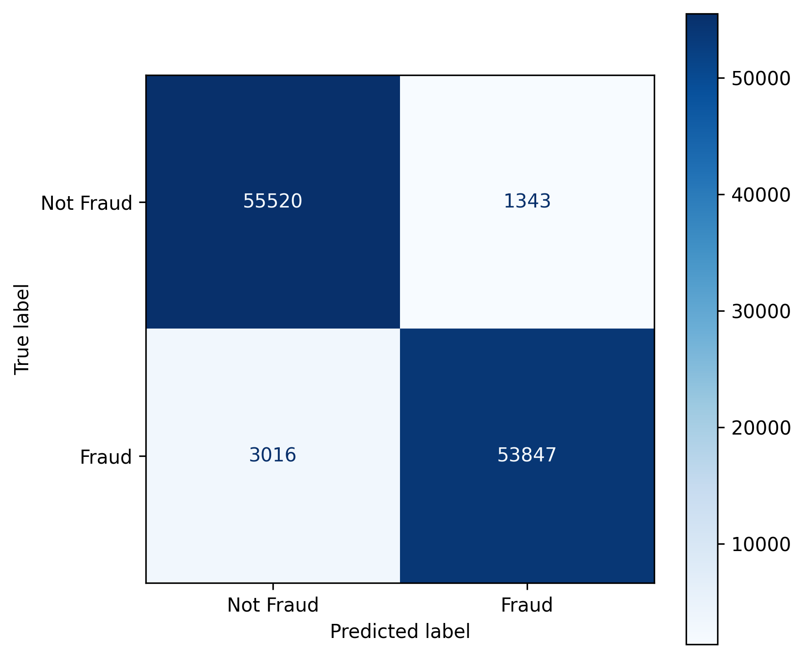

# Credit Card Fraud Detection

## Overview

Built a binary classification model to detect fraudulent credit card transactions using a balanced, anonymized dataset. The project focuses on feature analysis, preprocessing (including scaling and PCA), model training, and evaluation with an emphasis on recall (minimizing false negatives) while keeping precision high.

## Data & Preprocessing

**Insights**

- The dataset is well-balanced, with only a few outliers.
- Features `V1–V28` were already scaled, while `Amount` required standardization.
- Several variables were correlated, suggesting potential redundancy or interactions to explore.

## Methodology

**Data Preprocessing:**

- Handled outliers and verified no missing values were present.
- **Scaled** the `Amount` feature to align with the other already standardized variables.
- Applied **PCA** for dimensionality reduction and noise suppression, while maintaning relevant info.

**Modeling & Validation:**

- Implemented **K-Fold Cross-Validation** at the start to evaluate model stability and generalization.
- Initially tested three models: `Logistic Regression`, `Gradient Boosting`, and a `Neural Network`.
- `Gradient Boosting and Neural Network` were **discontinued** early due to long training times, as `Logistic Regression` already achieved **strong results** in cross-validation.
- `Logistic Regression` was then selected for **further optimization**.

**Hyperparameter Tuning:**

- Fine-tuned `Logistic Regression` using **Randomized Search** to optimize regularization strength and solver parameters, ensuring robust convergence.

## Results

Final Logistic Regression Performance (Test Set):

- Accuracy: `0.96`   
- Recall: `0.95`   
- F1 Score: `0.95`  
- Precision: `0.97`  

The model **successfully identifies the vast majority of fraudulent transactions**, with very few false negatives or false positives.

## Recommendations & Next Steps

- **Extended Hyperparameter Tuning:** Use Grid Search to further refine Logistic Regression parameters beyond the Randomized Search already performed.
- **Model Exploration**: Revisit Gradient Boosting and Neural Network models to evaluate their performance, as they were initially stopped due to long training times. 